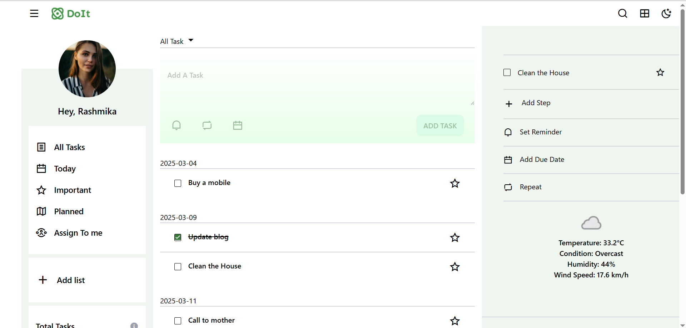
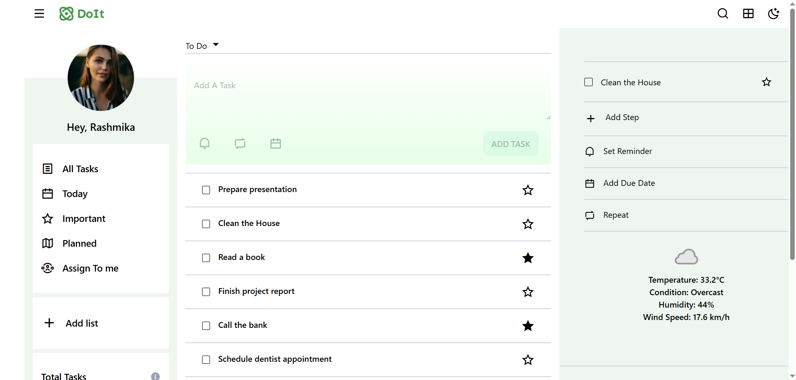
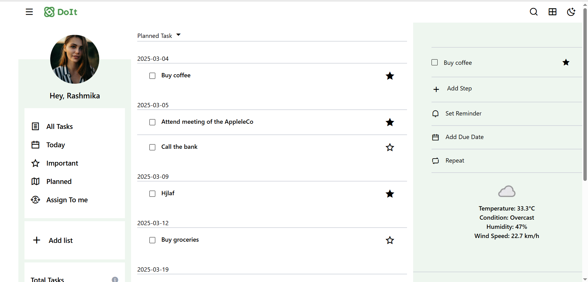

# 📝 ToDo App

🚀 **Live Demo**: [ToDo App](https://mohan-todolist.netlify.app/todo)

### 📝 All Task List



### 📝 Important Task List


### 📝 Today Task List



### 📝 Planned Task List



## 📌 Technologies Used

- **React.js** ⚛️
- **Redux** 🟣
- **Axios** 🌐
- **TailwindCSS** 🎨

---

## ✨ Features

1. 🌤 **Weather Integration**: Fetches weather data using WebAPI.
2. ➕ **Task Management**:
   - Add tasks 📌
   - Set task repeat 🔁
   - Assign a due date 📅
   - Set reminders ⏰
   - Mark important ⭐
   - Mark completed ✅
   - Delete tasks ❌
3. 📱 **Responsive Design**: Works on **mobile, tablet, and laptop**.
4. 🔍 **Task Details**: Click on a task to view its full details.
5. 📊 **Pie Chart**: Shows a breakdown of today’s tasks.
6. 📂 **Task Views**:
   - **List View** 📋
   - **Grid View** 🔲
7. 🗑 **Easy Deletion**: Delete tasks directly from the details view.

---

## 📄 Pages in the ToDo App

1. **📅 Today Page** – Displays today's tasks.
2. **🗂 All Tasks** – Lists all tasks sorted by date.
3. **⭐ Important Page** – Shows all important tasks.
4. **📆 Planned Page** – Lists tasks planned for future dates.

---

## 🚀 Getting Started

### 1️⃣ **Clone the Repository**

```bash
git clone https://github.com/your-username/todo-app.git
cd todo-app
```
